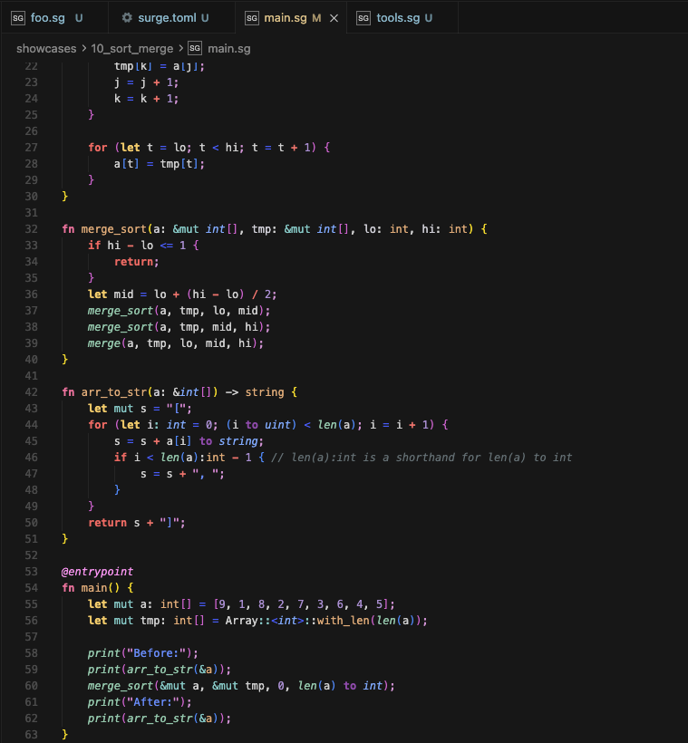
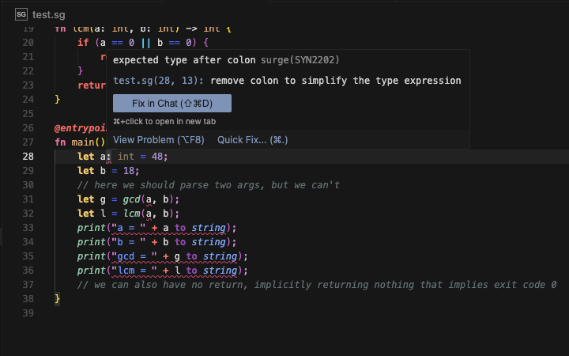
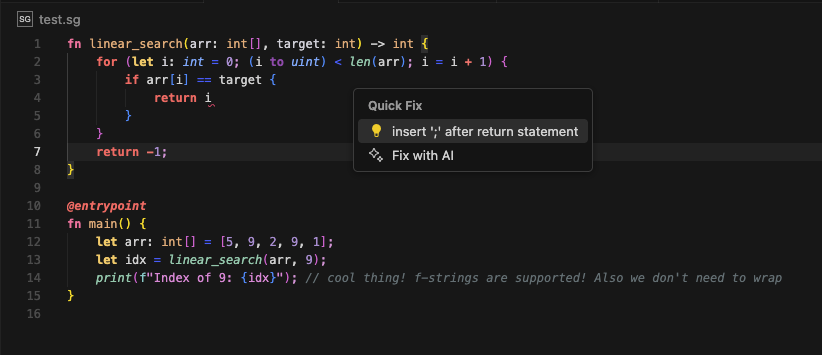

# Surge Syntax Highlighting for VS Code

Расширение VS Code для языка Surge (`.sg`) с подсветкой синтаксиса, диагностикой и быстрыми исправлениями.

## Возможности

- Подсветка синтаксиса: директивы, атрибуты, async/await, pattern matching и расширенные типы.
- Диагностика и заметки через `surge diag` с показом ошибок и предупреждений в редакторе.
- Quick Fix действия, если `surge` возвращает исправления.
- Собственная палитра TextMate только для Surge.
- Корректное оформление комментариев, строк, чисел и аннотаций (`@pure`, `@override`).

## Скриншоты

### Подсветка синтаксиса:

### Диагностика:

### Quick Fix:

## Установка

- Откройте `Extensions` (`Ctrl+Shift+X`), найдите "Surge Syntax Highlighting" и нажмите Install.
- Или установите из терминала: `code --install-extension surge.surge-syntax-highlighting`.

## Требования

- Для диагностики и Quick Fix нужен установленный `surge` CLI.
- Без `surge` расширение работает как подсветка синтаксиса.

## Настройка

- `surge.analyzer.executablePath` — путь до `surge`, используемого для диагностики (по умолчанию `surge`).

## Лицензия

MIT
